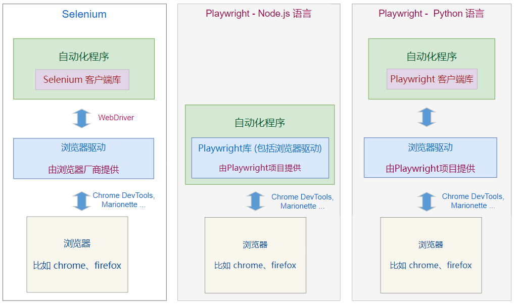

# 快速上手

## 1. 原理 

`Playwright` 是微软开发的 `Web应用` 的 `自动化测试框架` 。

它和另外一个 web自动化框架 `Selenium` 有 什么区别呢？


区别一：

Selenium 只提供了 Web 自动化功能， 如果你要做自动化测试，需要结合其它自动化测试框架

而 Playwright 是面向自动化测试的，除了Web自动化功能，它也包含了自动化测试的功能框架；


区别二：

两者的自动化原理有些差别，如下图所示。



## 2. 安装 

Playwright 也支持多种语言开发，比如 JavaScript/TypeScript， Python， Java， C#

### 2.1 安装 playwright 客户端库

执行 `pip install playwright`

### 2.2 安装 浏览器

playwright 这个项目默认使用自己编译好的几种浏览器，比如 `chromium， firefox， webkit`

这些浏览器是通过各自的开源项目编译出来的。

下载安装的 `Chrome，Firefox，Safri` 这些品牌浏览器（stock browser）的区别，[请看这里](https://stackoverflow.com/q/62184117/2602410)

playwright 每个版本都绑定 自编译浏览器的某个版本， 可以通过 [官方Release Note](https://playwright.dev/python/docs/release-notes) 看到对应关系

执行 `playwright install` 

如果只需要自动化一种浏览器，可以在参数中指定，比如 `playwright install chromium`。

> **说明**
>
> playwright 也可以自动化 已经安装好的品牌浏览器，比如Chrome, Edge, Firefox等，后文会有讲解
>


品牌浏览器往往会自动更新，如果使用Selenium自动化，就需要不断下载新的驱动。

playwright使用自编译浏览器不会自动更新，从而避免驱动和浏览器不匹配的问题。

## 3. 简单示例 

```python
from playwright.sync_api import sync_playwright

input('1....')
# 启动 playwright driver 进程
p = sync_playwright().start()

input('2....')
# 启动浏览器，返回 Browser 类型对象
browser = p.chromium.launch(headless=False)

# 创建新页面，返回 Page 类型对象
page = browser.new_page()
page.goto("https://www.byhy.net/cdn2/files/selenium/stock1.html")
print(page.title()) # 打印网页标题栏

# 输入通讯，点击查询。这是定位与操作
page.locator('#kw').fill('通讯')  # 输入通讯
page.locator('#go').click()      # 点击查询

# 打印所有搜索内容
lcs = page.locator(".result-item").all()
for lc in lcs:
    print(lc.inner_text())

input('3....')
# 关闭浏览器
browser.close()
input('4....')
# 关闭 playwright driver 进程
p.stop()
```


可以这样换一种浏览器，

```python
# 启动firefox浏览器
browser = p.firefox.launch(headless=False)

# 启动webkit浏览器
browser = p.webkit.launch(headless=False)
```


可以通过参数 `executable_path` 指定使用安装的其它浏览器

```python
# 加上 executable_path参数
browser = p.chromium.launch(headless=False,
  executable_path='c:\Program Files\Google\Chrome\Application\chrome.exe')
```


可以使用 `with as` 会话管理，我们的代码简化，不需要调用 `start()` 和 `stop()`

```python
from playwright.sync_api import sync_playwright

with sync_playwright() as p:
    browser = p.chromium.launch(headless=False)
    page = browser.new_page()
    page.goto("https://www.byhy.net/cdn2/files/selenium/stock1.html")
    print(page.title())
    page.locator('#kw').fill('通讯\n')
    page.locator('#go').click()
    # 打印所有搜索内容
    lcs = page.locator(".result-item").all()
    for lc in lcs:
        print(lc.inner_text())
    browser.close()
```

## 4. 界面等待 

上面的代码，不能打印出股票搜索的结果，

原因是：点击查询后，立即就去检查搜索结果了，这时，界面上还没有呈现结果，所以返回的是空结果

需要等待一段时间，比如2秒。

可以使用 Page 对象的 `wait_for_timeout` 方法达到等待效果，单位是 `毫秒`

```python
page.wait_for_timeout(1000)
```

## 5. 自动化代码助手 

Playwright 内置了 `代码助手` 的功能，可以帮我们产生 自动化代码

输入如下命令，即可启动代码助手

```bash
playwright codegen
```


注意这个只能作为助手，它主要是记录人对页面的输入。

并不能取代人自己写代码，特别是那些 `获取页面上信息` 的代码

比如，这个打印标题栏，就没法自动化生成

```
print(page.title())
```


还有这些，获取所有搜索内容 的代码

```python
# 打印所有搜索内容
lcs = page.locator(".result-item").all()
for lc in lcs:
    print(lc.inner_text())
```

## 6. 跟踪功能 

Playwright 有个特色功能： 跟踪（tracing）

启用跟踪功能后， 可以在执行自动化后，通过记录的跟踪数据文件， 回看自动化过程中的每个细节。


下面的的代码进行了自动化搜索股票，并打开跟踪功能，保存 跟踪数据文件 为 `trace.zip`。

```python
from playwright.sync_api import sync_playwright

p = sync_playwright().start()
browser = p.chromium.launch(headless=False)

# 创建 BrowserContext对象
context = browser.new_context()
# 启动跟踪功能
context.tracing.start(snapshots=True, sources=True, screenshots=True)

page = context.new_page()
page.goto("https://www.byhy.net/cdn2/files/selenium/stock1.html")

# 搜索名称中包含 通讯 的股票
page.locator('#kw').fill('通讯') 
page.locator('#go').click()

page.wait_for_timeout(1000) # 等待1秒

lcs = page.locator(".result-item").all()
for lc in lcs:
    print(lc.inner_text())

# 搜索名称中包含 软件 的股票
page.locator('#kw').fill('软件')  
page.locator('#go').click()    

page.wait_for_timeout(1000) # 等待1秒

lcs = page.locator(".result-item").all()
for lc in lcs:
    print(lc.inner_text())

# 结束跟踪
context.tracing.stop(path="trace.zip")

browser.close()
p.stop()
```


执行完以后，当前工作目录下面多了 trace.zip 这个跟踪数据文件。

查看这个跟踪文件有2种方法：

- 直接访问 [trace.playwright.dev](https://trace.playwright.dev/) 这个网站，上传 跟踪文件
- 执行命令 `playwright show-trace trace.zip`