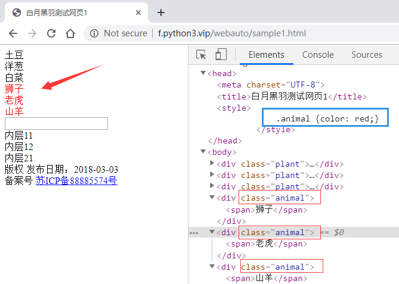
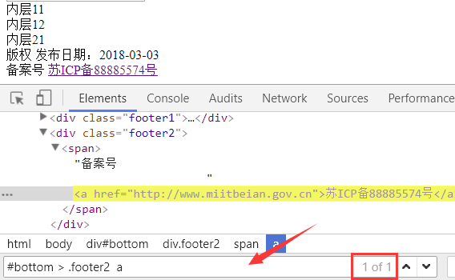
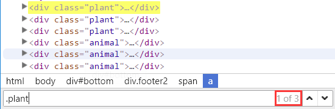

# CSS选择器 定位方法

## 1. 定位元素的重要性 

前面这段代码

```python
from playwright.sync_api import sync_playwright

p = sync_playwright().start()
browser = p.chromium.launch(headless=False)
page = browser.new_page()
page.goto("https://www.byhy.net/cdn2/files/selenium/stock1.html")

# 输入通讯，点击查询
page.locator('#kw').fill('通讯')
page.locator('#go').click() 

page.wait_for_timeout(1000)

# 打印所有搜索内容
lcs = page.locator(".result-item").all()
for lc in lcs:
    print(lc.inner_text())
```

其中， `输入通讯，点击查询` 对应两行代码，分别进行了 web 界面元素的 `定位` 和 `操作`


web 界面自动化，要对界面进行 `操作` ，首先需要 `定位` 界面元素。

就是 先告诉浏览器，你要操作 `哪个` 界面元素， 让它找到你要操作的界面元素。

必须要让浏览器 **先定位找到元素，然后，才能操作元素**。


相对来说，定位元素比后续的操作更难一些，

因为常见的操作并不是很多，而且就是一些固定的调用，比较容易理解。

比如

- 点击元素， `click()` 方法
- 元素内输入文本， `fill()` 方法
- 获取元素内部文本， `inner_text()` 方法

HTML网页元素特征定位，最典型的就是 `CSS Selector` 定位方法

## 2. CSS Selector 定位原理 

HTML中经常要 为 某些元素 指定 **显示效果**，比如 前景文字颜色是红色， 背景颜色是黑色， 字体是微软雅黑等。

那么CSS必须告诉浏览器：要 **选择哪些元素** ， 来使用这样的显示风格。

[点击这里，打开下图对应网页](https://www.byhy.net/cdn2/files/selenium/sample1.html)， `狮子/老虎/山羊` 显示为红色。



蓝色框里面用 css 样式，指定了class 值为 animal 的元素，要显示为红色。

其中 蓝色框里面的 .animal 就是 CSS Selector ，或者说 CSS 选择器。

CSS Selector 语法就是用来选择元素的。

既然 CSS Selector 语法 天生就是浏览器用来选择元素的， Playwright 自然就可以使用它用在自动化中，去选择要操作的元素了。


只要 CSS Selector 的语法是正确的， Playwright 就可以选择到该元素。

CSS Selector 非常强大，学习 Playwright Web自动化一定要学习 CSS Selector

## 3. Locator 对象 

Playwright 中，根据 CSS Selector 选择元素，就是使用 [Locator](https://playwright.dev/python/docs/api/class-locator) 类型的对象

比如，前文中， Page 对象的 locator方法就会创建一个 `Locator` 类型对象，参数就可以是 CSS Selector 表达式

```python
page.locator('#kw').fill('通讯')
page.locator('#go').click() 
```

Page对象的 locator 定位到的如果是唯一的 html 元素，就可以调用 Locator 对象的 方法，比如 `fill` , `click` , `inner_text` 等等对元素进行操作了。

具体使用方法见下文

## 4. 根据 tag名、id、class 选择元素 


CSS Selector 可以根据 `tag名` 、 `id 属性` 和 `class属性` 来 选择元素，

根据 tag名 选择元素的 CSS Selector 语法非常简单，直接写上tag名即可，

比如 要选择 所有的tag名为div的元素，就可以是这样

```python
locators = page.locator('div').all()
```

然后可以这样，打印所有的tag名为div的元素的内部可见文本

```python
for one in locators:
    print(one.inner_text())
```


要获取 所有的tag名为div的元素的内部可见文本，也可以直接调用 `all_inner_texts`

```python
texts = page.locator('div').all_inner_texts()
```


注意，如果 locator调用 `匹配的结果是多个元素` ， 调用 `针对单个元素的方法` ，比如 `inner_text` ，会有错误抛出：

```python
page.locator('div').inner_text()
```


------


根据id属性 选择元素的语法是在id号前面加上一个井号： `#id值`

比如 ，有下面这样的元素：

```
<input  type="text" id='searchtext' />
```

就可以使用 `#searchtext` 这样的 CSS Selector 来选择它。

比如，我们想在 `id 为 searchtext` 的输入框中输入文本 `你好` ，完整的Python代码如下

```python
lct = page.locator('#searchtext')
lct.fill('你好')
```


------


根据class属性 选择元素的语法是在 class 值 前面加上一个点： `.class值`

要选择 class 属性值为 animal的元素 动物，可以这样写

```
page.locator('.animal')
```


一个 学生张三 可以定义有 `多个` 类型： `中国人` 和 `学生` 。

`中国人` 和 `学生` 都是 张三 的 类型。

元素也可以有 `多个class类型` ，多个class类型的值之间用 `空格` 隔开，比如

```
<span class="chinese student">张三</span>
```

注意，这里 span元素 有两个class属性，分别 是 chinese 和 student， 而不是一个 名为 `chinese student` 的属性。

我们要用代码选择这个元素，可以指定任意一个class 属性值，都可以匹配到这个元素，如下

```
page.locator('.chinese')
```

或者

```
page.locator('.student')
```

而不能这样写

```
page.locator('.chinese student')
```

如果要表示同时具有两个class 属性，可以这样写

```
page.locator('.chinese.student')
```

## 5. 验证 CSS Selector 

那么我们怎么验证 CSS Selector 的语法是否正确选择了我们要选择的元素呢？

当然可以像下面这样，写出Python代码，运行看看，能否操作成功

```
page.locator('#searchtext').fill('输入的文本')
```

如果成功，说明选择元素的语法是正确的。


但是这样做的问题就是：太麻烦了。

当我们进行自动化开发的时候，有大量选择元素的语句，都要这样一个个的验证，就非常耗时间。


由于 CSS Selector 是浏览器直接支持的，可以在浏览器 **开发者工具栏** 中验证。

用Chrome浏览器打开 https://www.byhy.net/cdn2/files/selenium/sample1.html

按 F12 打开 开发者工具栏， 点击 Elements 标签后， 同时按 Ctrl 键 和 F 键， 就会出现下图箭头处的 搜索框



我们可以在里面输入任何 CSS Selector 表达式 ，如果能选择到元素， 右边的的红色方框里面就会显示出类似 `2 of 3` 这样的内容。

```
of 后面` 的数字表示这样的表达式 `总共选择到几个元素
of 前面` 的数字表示当前黄色高亮显示的是 `其中第几个元素
```

上图中的 `2 of 3` 就是指当前的 选择语法， 在当前网页上共选择到 3 个元素， 目前高亮显示的是第2个。

如果我们输入 `.plant` 就会发现，可以选择到3个元素



## 6. 匹配多个元素 

如果一个 locator表达式匹配多个元素，要获取所有的元素对应的 locator 对象，使用 `all方法`

```python
locators = page.locator('.plant').all()
```


有时，只需要得到某种表达式对应的元素数量 ，可以使用 `count方法`，如下

```python
count = page.locator('.plant').count()
```

返回结果就是匹配的元素数量。 可以根据返回结果是否为0 判断元素是否存在


有时，只需要得到某种表达式对应的第一个，或者最后一个元素。

可以使用 `first` 和 `last` 属性 ， 如下

```python
lct = page.locator('.plant')
print(lct.first.inner_text(), lct.last.inner_text())
```

也可以，通过 `nth` 方法，获取指定次序的元素，参数0表达第一个， 1 表示第2个，

比如

```python
lct = page.locator('.plant')
print(lct.nth(1).inner_text())
```

## 7. 元素内部定位 

前面都是通过 `Page` 对象调用的 locator 方法， 定位的范围是整个网页。

如果我们想在某个元素内部定位，可以通过 `Locator` 对象 调用 locator 方法。

比如

```python
lct = page.locator('#bottom')

# 在 #bottom 对应元素的范围内 寻找标签名为 span 的元素。
eles = lct.locator('span').all()
for e in eles:
    print(e.inner_text())
```

## 8. 选择 子元素 和 后代元素 

HTML中， 元素 内部可以 **包含其他元素**， 比如 下面的 HTML片段

```html
<div id='container'>

    <div id='layer1'>
        <div id='inner11'>
            <span>内层11</span>
        </div>
        <div id='inner12'>
            <span>内层12</span>
        </div>
    </div>

    <div id='layer2'>
        <div id='inner21'>
            <span>内层21</span>
        </div>
    </div>

</div>
```

id 为 `container` 的div元素 包含了 id 为 `layer1` 和 `layer2` 的两个div元素。

这种包含是直接包含， 中间没有其他的层次的元素了。 所以 id 为 `layer1` 和 `layer2` 的两个div元素 是 id 为 `container` 的div元素 的 **直接子元素**

而 id 为 `layer1` 的div元素 又包含了 id 为 `inner11` 和 `inner12` 的两个div元素。 中间没有其他层次的元素，所以这种包含关系也是 **直接子元素** 关系

id 为 `layer2` 的div元素 又包含了 id 为 `inner21` 这个div元素。 这种包含关系也是 **直接子元素** 关系


而对于 id 为 `container` 的div元素来说， id 为 `inner11` 、`inner12` 、`inner22` 的元素 和 两个 `span类型的元素` 都不是 它的直接子元素， 因为中间隔了 几层。

虽然不是直接子元素， 但是 它们还是在 `container` 的内部， 可以称之为它 的 **后代元素**

后代元素也包括了直接子元素， 比如 id 为 `layer1` 和 `layer2` 的两个div元素 也可以说 是 id 为 `container` 的div元素 的 **直接子元素，同时也是后代子元素**


如果 `元素2` 是 `元素1` 的 直接子元素， CSS Selector 选择子元素的语法是这样的

```
元素1 > 元素2
```

中间用一个大于号 （我们可以理解为箭头号）

注意，最终选择的元素是 **元素2**， 并且要求这个 **元素2** 是 **元素1** 的直接子元素


也支持更多层级的选择， 比如

```
元素1 > 元素2 > 元素3 > 元素4
```

就是选择 `元素1` 里面的子元素 `元素2` 里面的子元素 `元素3` 里面的子元素 `元素4` ， 最终选择的元素是 **元素4**


如果 `元素2` 是 `元素1` 的 后代元素， CSS Selector 选择后代元素的语法是这样的

```
元素1   元素2
```

中间是一个或者多个空格隔开

最终选择的元素是 **元素2** ， 并且要求这个 **元素2** 是 **元素1** 的后代元素。


也支持更多层级的选择， 比如

```
元素1   元素2   元素3  元素4
```

最终选择的元素是 **元素4**

例如可以将前面的代码改为：

```python
lct = page.('#bottom span')
print(lct.all_inner_texts())
```


## 9. 根据属性选择 


id、class 都是web元素的 `属性` ，因为它们是很常用的属性，所以css选择器专门提供了根据 id、class 选择的语法。

那么其他的属性呢？

比如

```html
<a href="http://www.miitbeian.gov.cn">苏ICP备88885574号</a>
```

css 选择器支持通过任何属性来选择元素，语法是用一个方括号 `[]` 。

比如要选择上面的a元素，就可以使用 `[href="http://www.miitbeian.gov.cn"]` 。

这个表达式的意思是，选择 属性href值为 `http://www.miitbeian.gov.cn` 的元素。

完整代码如下

```python
from playwright.sync_api import sync_playwright

p = sync_playwright().start()
browser = p.chromium.launch(headless=False, slow_mo=50)
page = browser.new_page()
page.goto("https://www.byhy.net/cdn2/files/selenium/sample1.html")

# 根据属性选择元素
element = page.locator('[href="http://www.miitbeian.gov.cn"]')
# 打印出元素文本
print(element.inner_text())
```


当然，前面可以加上标签名的限制，比如 `a[href="http://www.miitbeian.gov.cn"]` 表示 选择所有 标签名为 `a` ，且 属性 href值为 `http://www.miitbeian.gov.cn` 的元素。

属性值用单引号，双引号都可以。


根据属性选择，还可以不指定属性值，比如 `[href]` ， 表示选择 所有 具有 属性名 为href 的元素，不管它们的值是什么。


CSS 还可以选择 属性值 `包含` 某个字符串 的元素

比如， 要选择a节点，里面的href属性包含了 miitbeian 字符串，就可以这样写

```
a[href*="miitbeian"]
```


还可以 选择 属性值 以某个字符串 `开头` 的元素

比如， 要选择a节点，里面的href属性以 http 开头 ，就可以这样写

```
a[href^="http"]
```


还可以 选择 属性值 以某个字符串 `结尾` 的元素

比如， 要选择a节点，里面的href属性以 gov.cn 结尾 ，就可以这样写

```
a[href$="gov.cn"]
```


如果一个元素具有多个属性

```
<div class="misc" ctype="gun">沙漠之鹰</div>
```

CSS 选择器 可以指定 选择的元素要 同时具有多个属性的限制，像这样 `div[class=misc][ctype=gun]`

## 10. 选择语法联合使用 


CSS selector的另一个强大之处在于： 选择语法 可以 `联合使用`

比如， 我们要选择 如下网页中 html 中的元素 `版权1` 对应的 `span`

```css
<div id='bottom'>
    <div class='footer1'>
        <span class='copyright' name='cp1'>版权1</span>
        <span class='copyright' name='cp2'>版权2</span>
        <span class='copyright1' name='cp1'>版权3</span>
    </div>
    <div class='footer2'>
        <span class='copyright' name='cp1'>版权4</span>
    </div>        
</div>         
```

CSS selector 表达式 可以这样写：

```
.footer1 > .copyright[name=cp1]
```

## 11. 组选择 


如果我们要 同时选择所有class 为 plant `和` class 为 animal 的元素。怎么办？

这种情况，css选择器可以 使用 `逗号` ，称之为 组选择 ，像这样

```
.plant , .animal
```


再比如，我们要同时选择所有tag名为div的元素 `和` id为BYHY的元素，就可以像这样写

```
div,#BYHY
```

对应的Playwright代码如下

```python
elements = page.locator('div,#BYHY')
for element in elements:
    print(element.inner_text())
```


[请点击打开这个网址](https://www.byhy.net/cdn2/files/selenium/sample1a.html)

要选择所有 唐诗里面的作者和诗名， 也就是选择所有 id 为 t1 里面的 `span 和 p 元素`

若这样去写是不行的

```
#t1 > span,p
```

这样写的意思是 选择所有 `id 为 t1 里面的 span` 和 `所有的 p 元素`

只能这样写

```
#t1 > span , #t1 > p
```


另外注意：组选择结果列表中，选中元素排序， 不是 组表达式的次序， 而是符合这些表达式的元素，在HTML文档中的出现的次序。

## 12. 按次序选择子节点 

[请点击打开这个网址](https://www.byhy.net/cdn2/files/selenium/sample1b.html)

对应的 html 如下，关键信息如下

```html
    <body>  
       <div id='t1'>
           <h3> 唐诗 </h3>
           <span>李白</span>
           <p>静夜思</p>
           <span>杜甫</span>
           <p>春夜喜雨</p>              
       </div>      

       <div id='t2'>
           <h3> 宋词 </h3>
           <span>苏轼</span>
           <p>赤壁怀古</p>
           <p>明月几时有</p>
           <p>江城子·乙卯正月二十日夜记梦</p>
           <p>蝶恋花·春景</p>
           <span>辛弃疾</span>
           <p>京口北固亭怀古</p>
           <p>青玉案·元夕</p>
           <p>西江月·夜行黄沙道中</p>
       </div>             

    </body>
```

### 12.1 父元素的第n个子节点

可以指定选择的元素 `是父元素的第几个子节点`

使用 `nth-child`

比如，

要选择 唐诗 和宋词 的第一个 作者，

也就是说 选择的是 第2个子元素，并且是span类型

所以这样可以这样写 `span:nth-child(2)` ，


如果不加节点类型限制，直接这样写 `:nth-child(2)`

就是选择所有位置为第2个的所有元素，不管是什么类型

### 12.2 父元素的倒数第n个子节点

也可以反过来， 选择的是父元素的 `倒数第几个子节点` ，使用 `nth-last-child`

比如：

```
p:nth-last-child(1)
```

就是选择第倒数第1个子元素，并且是p元素

### 12.3 父元素的第几个某类型的子节点

我们可以指定选择的元素 是父元素的第几个 `某类型的` 子节点

使用 `nth-of-type`

比如，

我们要选择 唐诗 和宋词 的第一个 作者，

可以像上面那样思考：选择的是 第2个子元素，并且是span类型

所以这样可以这样写 `span:nth-child(2)` ，


还可以这样思考，选择的是 `第1个span类型` 的子元素

所以也可以这样写 `span:nth-of-type(1)`

### 12.4 父元素的倒数第几个某类型的子节点

当然也可以反过来， 选择父元素的 `倒数第几个某类型` 的子节点

使用 `nth-last-of-type`

像这样

```
p:nth-last-of-type(2)
```

### 12.5 奇数节点和偶数节点

如果要选择的是父元素的 `偶数节点`，使用 `nth-child(even)`

比如

```
p:nth-child(even)
```

如果要选择的是父元素的 `奇数节点`，使用 `nth-child(odd)`

```
p:nth-child(odd)
```


如果要选择的是父元素的 `某类型偶数节点`，使用 `nth-of-type(even)`

如果要选择的是父元素的 `某类型奇数节点`，使用 `nth-of-type(odd)`

## 13. 兄弟节点选择 

### 13.1 相邻兄弟节点选择

上面的例子里面，我们要选择 唐诗 和宋词 的第一个 作者

还有一种思考方法，就是选择 h3 `后面紧跟着的兄弟节点` span。

这就是一种 相邻兄弟 关系，可以这样写 `h3 + span`

表示元素 紧跟关系的 是 `加号`

### 13.2 后续所有兄弟节点选择

如果要选择是 选择 h3 `后面所有的兄弟节点` span，可以这样写 `h3 ~ span`