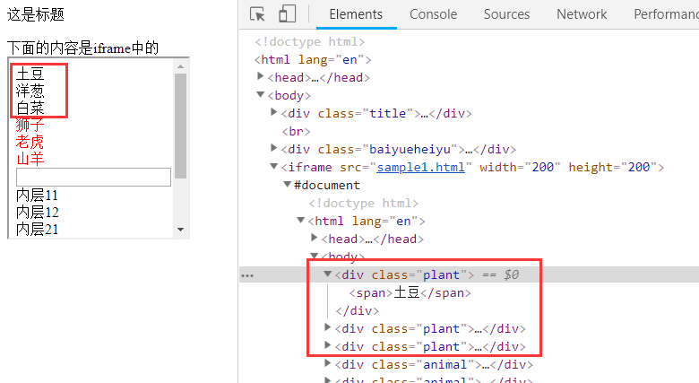
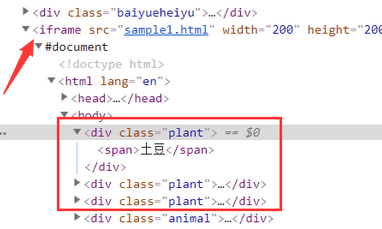
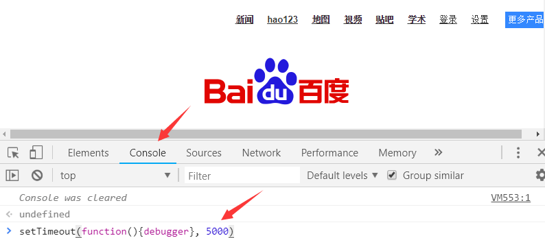

# frame/tab 切换，一些技巧

## 1. frame切换 

[打开这个链接](https://www.byhy.net/cdn2/files/selenium/sample2.html)

如果我们要 选择 下图方框中 所有的 蔬菜，使用css选择

当然，要先查看到它们的html元素特征



写出如下代码：

```python
from playwright.sync_api import sync_playwright
p = sync_playwright().start()

browser = p.chromium.launch(headless=False)
page = browser.new_page()

page.goto("https://www.byhy.net/cdn2/files/selenium/sample2.html")

lcs = page.locator('.plant').all()
for lc in lcs:
    print(lc.inner_text(timeout=1000))
```

运行一下，就会发现，运行结果打印内容为空白，说明没有选择到 class 属性值为 plant 的元素。

仔细看，可以发现， 这些元素是在一个叫 `iframe` 的 元素中的。



这个 iframe 元素非常的特殊， 在html语法中， `frame` 元素 或者 `iframe` 元素的内部 会包含一个 **被嵌入的** 另一份html文档。

在我们使用 Playwright 打开一个网页时， 操作范围 缺省是当前的 html ， 并不包含被嵌入的html文档里面的内容。

如果我们要 定位/操作 被嵌入的 html 文档 中的元素， 就必须 `切换操作范围` 到 被嵌入的文档中。

使用 Page 或者 Locator 对象的 `frame_locator` 方法定位到你要操作的frame。

这个 方法会产生一个 `FrameLocator` 对象，后续的定位，就使用这个对象，在其内部进行定位。

像这样

```python
# 产生一个  FrameLocator 对象
frame = page.frame_locator("iframe[src='sample1.html']")

# 再 在其内部进行定位
lcs = frame.locator('.plant').all()
for lc in lcs:
    print(lc.inner_text(timeout=1000))
```

其中， `frame_locator` 方法的参数是 css 或者 xpath selector


## 2. 窗口切换 

在网页上操作的时候，我们经常遇到，点击一个链接 或者 按钮，就会打开一个 `新窗口` 。

[打开这个链接](https://www.byhy.net/cdn2/files/selenium/sample3.html)

在打开的网页中，点击 链接 `访问bing网站` ， 就会弹出一个新窗口，访问bing网址。

如果用 Playwright 写自动化程序 **在新窗口里面 打开一个新网址**， 并且去自动化操作新窗口里面的元素，会有什么问题呢？

运行如下代码验证一下

```python
from playwright.sync_api import sync_playwright
p = sync_playwright().start()

browser = p.chromium.launch(headless=False)
page = browser.new_page()

page.goto("https://www.byhy.net/cdn2/files/selenium/sample3.html")

# 点击链接，打开新窗口
page.locator("a").click()

# 打印网页窗口标题
print(page.title())
```


运行完程序后，最后一行 打印当前窗口的标题栏 文本， 输出内容是

```
白月黑羽测试网页3
```

问题就在于，即使新窗口打开了， 这时候，我们的 page 变量对应的 还是老窗口，自动化操作也还是在老窗口进行，


如果我们要到新的窗口里面操作，该怎么做呢？

这时，需要使用 BrowserContext 对象。如下

```python
from playwright.sync_api import sync_playwright
pw = sync_playwright().start()

browser = pw.chromium.launch(headless=False)

# 创建 BrowserContext 对象
context = browser.new_context()

# 通过context 创建page
page = context.new_page() 

page.goto("https://www.byhy.net/cdn2/files/selenium/sample3.html")

# 点击链接，打开新窗口
page.locator("a").click()

# 等待2秒， 不能用 time.sleep
page.wait_for_timeout(2000)

# pages属性是 所有窗口对应Page对象的列表
newPage = context.pages[1]

# 打印新网页窗口标题
print(newPage.title())

# 打印老网页窗口标题
print(page.title())
```

`BrowserContext` 对象有个 `pages` 属性，这是一个列表，里面依次为所有窗口对应Page对象。

我们就可以通过不同的page对象操作对应的不同窗口了。


如果自动化打开了很多链接窗口，不知道目标窗口的次序号，这时可以根据标题栏定位到要操作的page

那么我们就可以通过 类似下面的代码，

```python
for pg in  context.pages:
    # 得到该窗口的标题栏字符串，判断是不是我们要操作的那个窗口
    if '必应' in pg.title():
        break

print(pg.title())   
```

### 2.1 设置当前tab

如果当前界面有很多窗口，要把某个窗口作为当前活动窗口显示出来，可以调用该窗口对应的Page对象的 [bring_to_front](https://playwright.dev/python/docs/api/class-page#page-bring-to-front) 方法。

### 2.2 关闭网页窗口

前面学过Browser对象有close 方法，那是关闭整个浏览器。

如果只是要关闭某个网页窗口，可以调用该窗口对应的Page对象的 [close](https://playwright.dev/python/docs/api/class-page#page-close) 方法。

## 3. 冻结界面 

有些网站上面的元素， 我们鼠标放在上面，会动态弹出一些内容。

比如，百度首页的导航栏，有个 **更多** 选项

如果我们把鼠标放在上边，就会弹出 一个更多产品内容的图标页 。

如果我们要用 Playwright 自动化 点击 其中一个产品，比如 `音乐` ，就需要 F12 查看这个元素的特征。

但是 当我们的鼠标 从 `音乐` 移开， 这个 栏目就整个消失了， 就没法 查看 其对应的 HTML。

怎么办？

可以如下图所示：




在 开发者工具栏 console 里面执行如下js代码

```
setTimeout(function(){debugger}, 5000)
```


表示在 5000毫秒后，执行 debugger 命令

执行该命令会 浏览器会进入debug状态。 debug状态有个特性， 界面被冻住， 不管我们怎么点击界面都不会触发事件。


所以，我们可以在输入上面代码并回车 执行后， 立即 鼠标放在界面 右上角 更多产品处。

这时候，就会弹出 下面的 图标。

然后，我们仔细等待 5秒 到了以后， 界面就会因为执行了 debugger 命令而被冻住。

然后，我们就可以点击 开发者工具栏的 查看箭头， 再去 点击 `音乐` 图标 ，查看其属性了。

## 4. 截屏 

要 `整个网页` 截屏，使用 Page 对象的 [screenshot](https://playwright.dev/python/docs/api/class-page#page-screenshot) 方法。

比如

```
# 截屏当前页面可见内容，保存到当前工作目录下的ss1.png文件中
page.screenshot(path='ss1.png')

# 截屏 完整页面，页面内容长度超过窗口高度时，包括不可见部分。
page.screenshot(path='ss1.png', full_page=True)
```


也可以只对 `某个元素的显示内容` 进行截屏，使用 Locator 对象的 [screenshot](https://playwright.dev/python/docs/api/class-locator#locator-screenshot) 方法。

比如

```
page.locator('input[type=file]').screenshot(path='ss2.png')
```

## 5. 拖拽 

要实现拖拽功能，可以使用Page对象的 [drag_and_drop](https://playwright.dev/python/docs/api/class-page#page-drag-and-drop) 方法。

比如，对下面这段 html

```
<span id="t1">t1</span>
<span id="t2">t2</span>


<form >
  <div id="captcha">
  </div>
  <input type="text" placeholder="captcha" />
  <button type="submit">Submit</button>
</form>
```

要选中 `span#t1` 文本内容，并且拖拽到 输入框 `[placeholder="captcha"]` 里面去，可以使用如下代码：

```
# 选中  `span#t1`  文本内容
page.locator('#t1').select_text()

# 拖拽到 输入框  `[placeholder="captcha"]` 里面去
page.drag_and_drop('#t1', '[placeholder="captcha"]')
```

drag_and_drop 方法的：

第1个参数是被拖动元素的 css selector 或者 xpath selector ， 如果可以匹配页面多个元素，取第一个匹配到的元素

第1个参数是拖动目标元素的 css selector 或者 xpath selector， 如果可以匹配页面多个元素，取第一个匹配到的元素


如果被拖动元素的Locator对象已经产生，可以直接调用其 [drag_to](https://playwright.dev/python/docs/api/class-locator#locator-drag-to) 方法 进行拖动

上例中，代码也可以这样写

```
# 选中  `span#t1`  文本内容
lc = page.locator('#t1')

lc.select_text()

# 拖拽到 输入框  `[placeholder="captcha"]` 里面去
lc.drag_to(page.locator('[placeholder="captcha"]'))
```

**注意**， drag_to 的参数是 目标元素的 Locator 对象 ， 而不是 selector 表达式字符串

## 6. 弹出对话框 

有的时候，我们经常会在操作界面的时候，出现一些弹出的对话框。

[请点击打开这个网址](https://www.byhy.net/cdn2/files/selenium/test4.html)

分别点击界面的3个按钮，你可以发现：

弹出的对话框有三种类型，分别是 `alert（警告信息）` 、 `confirm（确认信息）` 和 `prompt（提示输入）`

### 6.1 Alert

Alert 弹出框，目的就是显示通知信息，只需用户看完信息后，点击 OK（确定） 就可以了。

那么，自动化的时候，代码怎么模拟用户点击 OK 按钮呢？

可以这样

```
from playwright.sync_api import sync_playwright
pw = sync_playwright().start()
browser = pw.chromium.launch(headless=False)
page = browser.new_page()
page.goto("https://www.byhy.net/cdn2/files/selenium/test4.html")

# 处理 弹出对话框 的 回调函数
def handleDlg(dialog):
    # 等待1秒
    page.wait_for_timeout(1000)
    # 点击确定
    dialog.accept()
    # 打印 弹出框 提示信息
    print(dialog.message) 

# 设置弹出对话框事件回调函数
page.on("dialog", handleDlg )

# 点击 alert 按钮
page.locator('#b1').click()
```

处理函数中被回调时，会传入 [Dialog](https://playwright.dev/python/docs/api/class-dialog) 对象

这个对象的

`accept` 方法作用等同于点击确定按钮

`dismiss` 方法作用等同于点击取消按钮

`message` 属性就是对话框界面的提示信息字符串


**注意**：

- 注册的处理函数中一定要调用 `accept` 或者 `dismiss` 方法，让对话框消失。

否则当对话框弹出时，后续任何代码都不会执行，并且会有超时错误。

比如

```
from playwright.sync_api import sync_playwright
pw = sync_playwright().start()
browser = pw.chromium.launch(headless=False)
page = browser.new_page()
page.goto("https://www.byhy.net/cdn2/files/selenium/test4.html")

# 处理 弹出对话框 的 回调函数
def handleDlg(dialog):
    print('不调用accept')

page.on("dialog", handleDlg )

#点击 alert 按钮
page.locator('#b1').click()

print('后续代码')
```

会发现，点击alert 按钮之后的后续代码不会执行

- Playwright 在界面有弹出框时，发现如果没有任何注册的处理函数，会自动点击取消

比如

```
# 注释掉 事件回调函数
# page.on("dialog", handleDlg )

#点击 alert 按钮
page.locator('#b1').click()
print('点击1次')

page.wait_for_timeout(1000)

#点击 alert 按钮
page.locator('#b1').click()
print('点击2次')
```

会发现，对话框自动取消

### 6.2 Confirm

Confirm弹出框，主要是让用户确认是否要进行某个操作。

比如：当管理员在网站上选择删除某个账号时，就可能会弹出 Confirm弹出框， 要求确认是否确定要删除。

Confirm弹出框 有两个选择供用户选择，分别是 `OK` 和 `Cancel` ， 分别代表 `确定` 和 `取消` 操作。

那么，自动化的时候，代码怎么模拟用户点击 `确定` 或者 `取消` 按钮呢？

前面说过，处理函数中被回调时，会传入 [Dialog](https://playwright.dev/python/docs/api/class-dialog) 对象

这个对象的

`accept` 方法作用等同于点击确定按钮

`dismiss` 方法作用等同于点击取消按钮


比如，前面的代码改为

```
from playwright.sync_api import sync_playwright
pw = sync_playwright().start()

browser = pw.chromium.launch(headless=False)
page = browser.new_page()
page.goto("https://www.byhy.net/cdn2/files/selenium/test4.html")

def handleDlg(dialog):    
    page.wait_for_timeout(1000)
    dialog.dismiss() # 点击取消

page.on("dialog", handleDlg)

# 点击 confirm 按钮
page.locator('#b2').click()


input('....')
```

会发现打印出来的是 `取消操作`

### 6.3 Prompt

出现 Prompt 弹出框 是需要用户输入一些信息，提交上去。

比如：当管理员在网站上选择给某个账号延期时，就可能会弹出 Prompt 弹出框， 要求输入延期多长时间。

怎么办呢？

[Dialog](https://playwright.dev/python/docs/api/class-dialog) 对象，这个对象的 `accept` 方法可以输入参数字符串，作为要输入的信息


比如，前面的代码改为

```
from playwright.sync_api import sync_playwright
pw = sync_playwright().start()
browser = pw.chromium.launch(headless=False)
page = browser.new_page()
page.goto("https://www.byhy.net/cdn2/files/selenium/test4.html")


def handleDlg(dialog):    
    page.wait_for_timeout(1000)
    dialog.accept('你好啊') # 输入信息，并确定

page.on("dialog", handleDlg)

# 点击 confirm 按钮
page.locator('#b3').click()

input('....')
```