# Vscode playwright录制指南

**如何进入测试模式？**

Playwright的测试窗口在vscode中左侧边栏的“测试”选项中

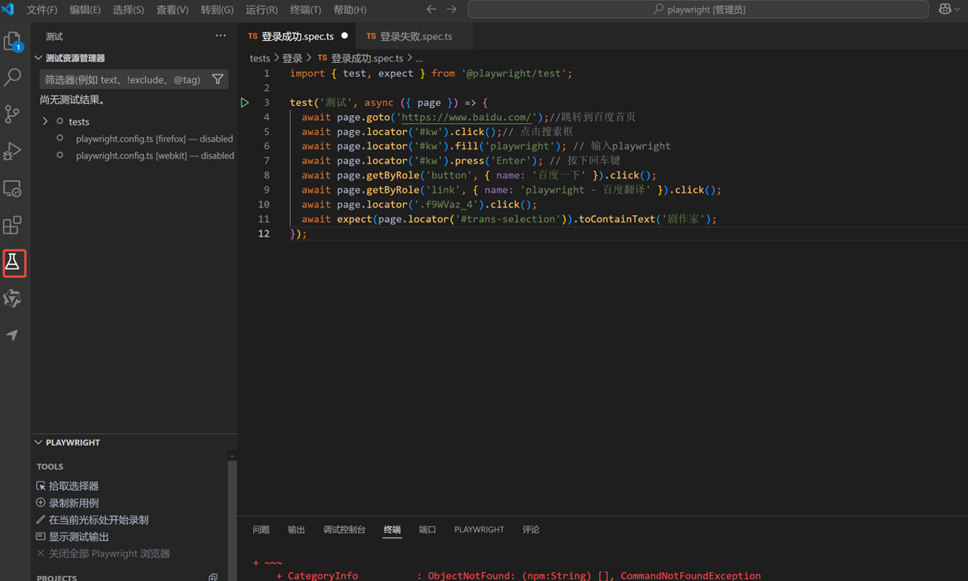

 

## 1. 1 功能介绍 

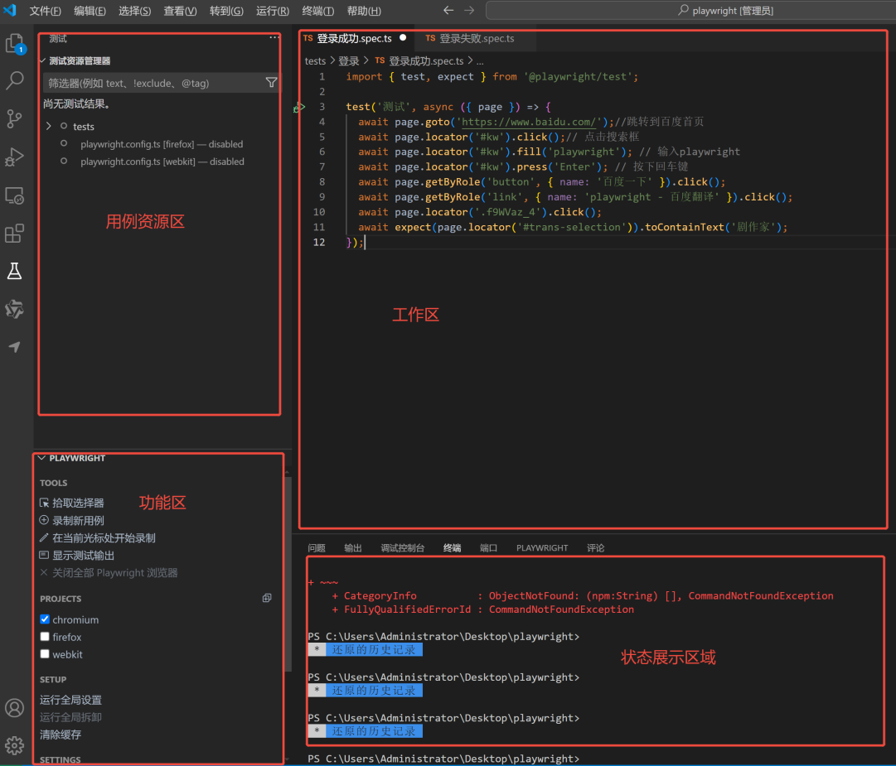

### 1.1 1.1 用例资源区

用例资源区管理所有的测试用例，以tests目录为顶层目录，可以建立多个测试模块，测试脚本为 ***用例名称.spec.ts\*** 形式，一个测试用例可以包含多个测试点，树形结构中的每一项都是可以运行的，例如：鼠标停留在tests节点下，会出现多个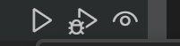按钮，点击运行，会将tests目录下的所有测试用例都运行一次；点击登录成功中的运行按钮，则只会运行登录成功测试用例中的“测试”这条测试点。

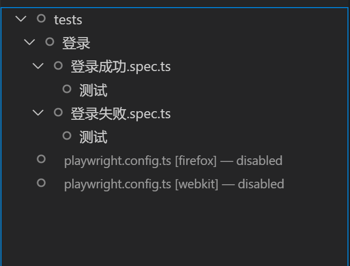

### 1.2 1.2 功能区

功能区的功能很多，此处介绍一些我们常用的功能，proects下为浏览器类型，按需选则即可，支持多选。

1. 拾取选择器：如果当前没有打开的浏览器，点击后会启动一个新的浏览器，（如果当前打开了一个浏览器，则会使用当前浏览器)可以在浏览器中选中一个元素，选中的元素会在状态展示区展示该元素的定位方式
2. 录制新用例：点击后会在tests目录下创建一个 ***test-n.spec.ts\*** 的测试脚本，会弹出一个浏览器，在浏览器中按照自己设定好的测试思路依次操做即可，操作后会录制一个脚本
3. 在当前光标处开始录制：当我们已有一个测试操作，不想从头开始录制时，可以复制一个该测试脚本，将工作区的文本光标移动到想要继续录制操作的下一行，先运行该测试用例，脚本运行到光标处后我们就可以点击”在光标处开始录制“按钮并接着操作，录制后续的步骤即可
4. 显示测试输出：点击该按钮会在状态展示区显示测试结果的输出
5. 显示浏览器：勾选后我们的所有脚本都会将浏览器弹出来，展示运行界面，取消勾选则会在后台运行，只展示最后的测试结果
	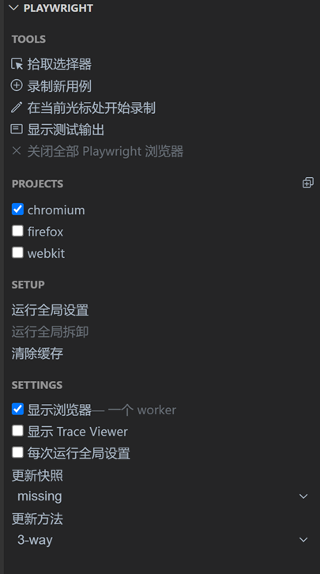

 

 

 

 

 

 

### 1.3 1.3 工作区

工作区为代码编辑区域，可以手动编写对应的代码或通过录制实现代码的自动编写

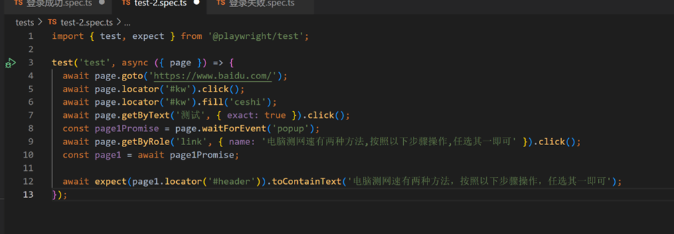

测试用例只能以**test**开头，传入的参数“test”为用例标题，按照自己的测试逻辑填入即可，

test方法的花括号中即为测试的代码，点击录制新用例，会默认创建一个测试标题为“test”的测试用例，录制过程会根据操作持续创建脚本。

每个可运行的测试用例的侧标都会有一个运行按钮，点击后即可回放录制好的代码。

在侧边栏中，可以选择对应的行，点击后会产生一个红色的圆点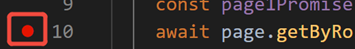，在用例资源管理区，选择当前的测试用例，点击调试测试按钮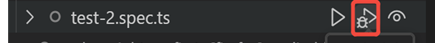即可进入调试模式，当我们的代码运行到断点位置时，浏览器会自动停止，方便我们排查问题。

 

### 1.4 1.4 状态展示区

状态展示区会展示我们的测试情况：如果通过多少用例，失败多少，错误原因等等信息

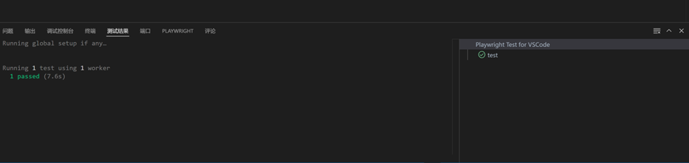)

 

 

 

 

 

## 2. 2 典型案例 

用例录制开始前，请先思考清楚这条用例属于哪个模块、执行哪些步骤、需要检查的测试结果

 

### 2.1 2.1 从零开始录制的测试用例

假设我们需要录制一个登录功能的测试用例，首先应该列出具体的操作步骤及对应的预期结果，此处以一个简单的用例举例：

1. 正常登录

模块：登录模块

测试步骤:

输入正确的用户名（如：test01）

输入正确的密码（如：111111）

点击“登录”按钮

预期结果:

登录成功，跳转到用户主页/仪表盘。

 

我们录制脚本时，就需要按照步骤一步一步上输入和点击即可，重点是预期结果的判断，比如这个用例需要判断的是用户登录成功，判断登录成功有很多方法：url变更为登录成功首页的url ；检查一个登录成功后才会出来的元素可见等方法。

Playwright在录制时提供了很多断言的方法：

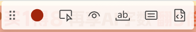

其中：

* 按钮为检查元素可见性的断言，点击该按钮后可以选择当前页面的一个元素，断言它一定可见，在代码中的表示即为：

```ts
await expect(page.getByText('首页')).toBeVisible();
```

* 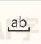按钮为检查元素文本中是否包含某个文本内容，点击该按钮后再选择当前页面的一个有文本内容的元素，会弹出一个输入窗口，窗口内容如下，

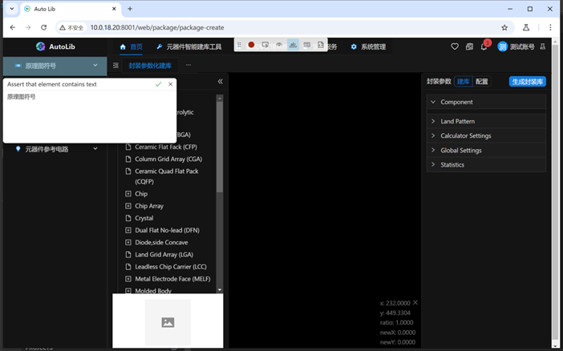

 

可以在弹出的窗口中确认该元素是否一定会包含某些文本，如果是，点击√，点击后会在代码中生成如下断言内容：

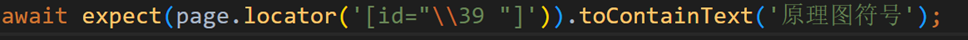

以上两种断言方式能覆盖绝大多数元素校验的场景，如果需要其他校验方式，可以参考：
 https://playwright.dev/docs/writing-tests#assertions

 

综上，我们最后录制的脚本应如下：

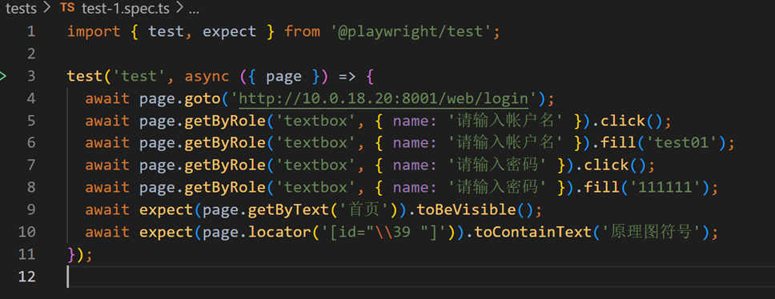

 

录制完成后，Ctrl+S保存用例，我们还需要将用例管理起来，方便后续的维护和执行，我们回到文件资源管理器，找到刚刚保存的测试用例：

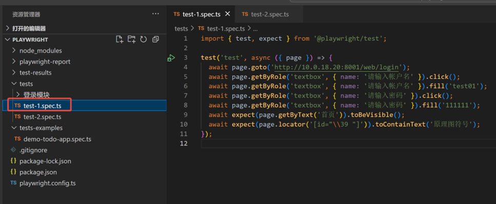

首先，我们需要将该文件重命名，名字应该能一眼看出该用例测试的意图，比如此处我们可以命名为“***登录成功\******.spec.ts\***”,然后将文件放到对应的模块中，再修改脚本中的测试标题，此处也可以编写为“登录成功”，之后完善我们的注释部分，最后的用例目录层级及内容如下：

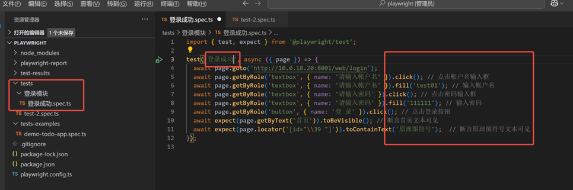

至此，我们完成了一个简单用例的编写。

 

### 2.2 2.2 基于现有的测试脚本编写测试用例

很多时候，我们准备编写的测试用例和现有的测试用例有很多重复的部分，本小节就写一个简单的例子，介绍一下我们怎么通过现有的测试用例减少录制过程。

首先，我们还是要先明确我们的目标，应该列出具体的操作步骤及对应的预期结果，此处以一个简单的登录失败用例举例：

1. 登录失败

模块：登录模块

测试步骤:

输入错误的用户名（如：scscsc）

输入错误的密码（如：P@ssw0rd123）

点击“登录”按钮

预期结果:

弹出“用户名或密码错误”提示。

 

该用例与现有的登录成功的操作步骤都一致，只是结果不同。我们先复制一份登录成功的测试用例在登录模块下并将其改名为“***登录失败\******.spec.ts\***”,将测试脚本中的标题也修改为“登录失败”，我们的操作完全一致，但是输入内容和校验内容不同，所以应该修改输入的参数值并且删除脚本中断言的部分，预处理后脚本如下：

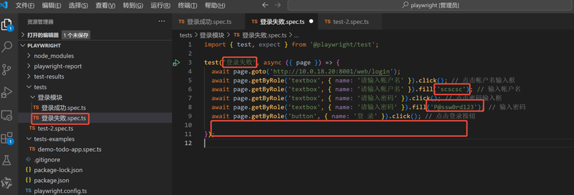

在vscode“测试”栏中运行对应的代码，结果如下：

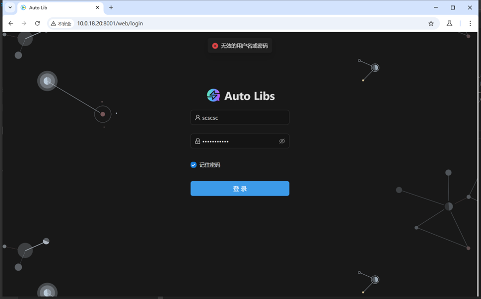

不要关闭浏览器，我们将光标移到点击登录的下方：

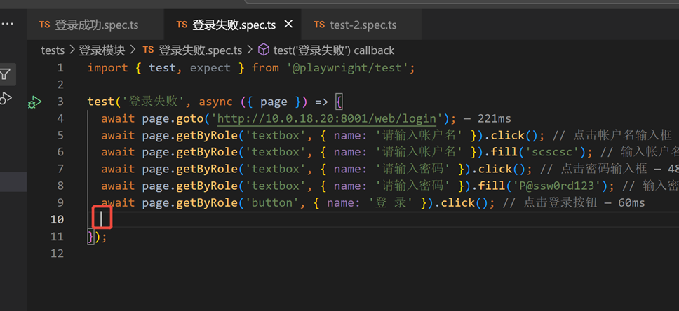

选择功能区的，在浏览器界面中再次点击一次登录，并且添加一个弹窗内容的断言（一定要快一点，不然弹窗就消失了)

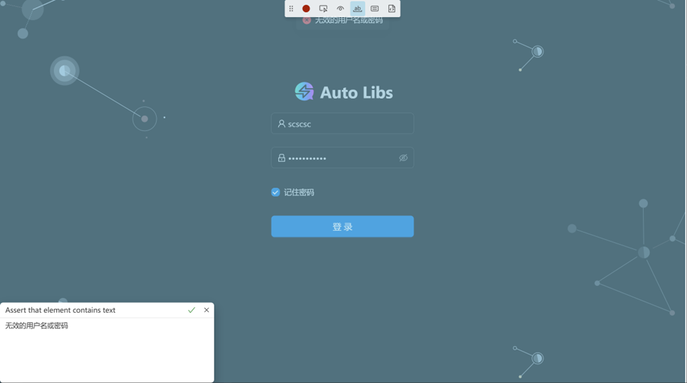

点击√，脚本的录制就完成了

此时，我们再查看我们的脚本，登录按钮和断言都被录制了

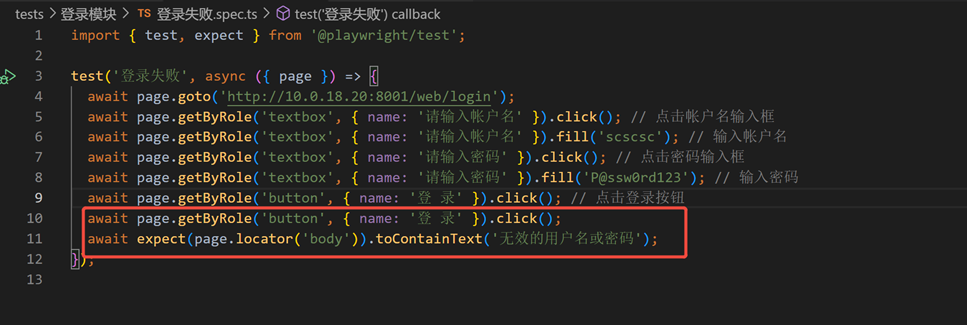

但是我们原本的脚本点击过登录按钮，所以我们需要删除该代码，并且为断言添加一个注释

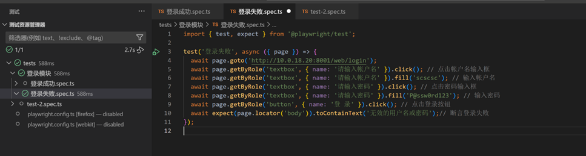

最后，运行一次，没有问题后保存代码即可。

 

 

 

 

 

## 3. 3 补充 

各位测试时，有生成文件的校验，可以不用在脚本中写断言，请自行下载并检查文件生成是否正确，正确的文件可以放在测试文件夹下，与用例名称一致即可（测试用例名称必须唯一），如下：

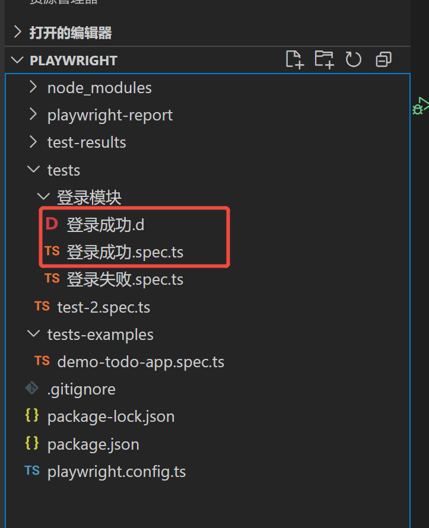

 

 

 

 

 

 

 

 

 
