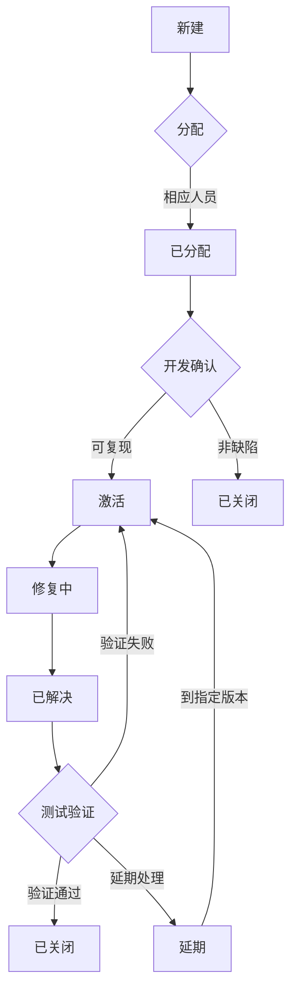

# Bug 管理规范

## 1. Bug 编写规范

| 字段名         | 规范要求                                                                 | 示例说明                                  |
|----------------|--------------------------------------------------------------------------|------------------------------------------|
| **标题**       | 简明扼要描述核心问题                                          | 验证输出窗口功能 |
| **严重程度**   | 按影响分级： 1-致命 2-严重 3-一般 4-建议                              | 选择“2-严重”                             |
| **优先级**     | 修复紧急度： 1-立即 2-高 3-中 4-低                                    | 选择“2-高”                               |
| **影响版本**   | **必填** 发现缺陷的软件版本                                              | Saliwind4.0_Router_Automation  |
| **前置条件**   | 填写测试的前置                                        | 1.router 软件可用    |
| **重现步骤**   | 需包含完整操作路径和测试数据 | **分步骤编写**： 1. 在工具栏右键，选择输出窗口 2. 在输出窗口状态栏选择清楚日志  |
| **期望结果**   | 明确符合需求的标准行为                                                   | 功能正常且日志将会全部被清空 |
| **实际结果**   | 客观描述异常现象                                                         | 功能正常且日志将会全部被清空 |
| **附件**       | 必须包含： - 错误截图（标注异常点） - 操作视频（gif） - 日志、崩溃文件 | 07092004.dump       |
| **平台**       | 测试环境信息： - 浏览器/设备型号 - 操作系统版本 - 网络环境       | Chrome/Win11/5G网络                  |

**规范要点：**

重现步骤需包含**完整操作路径**和**精确测试数据**。

- 示例：

1. 使用测试账号 user01/pass123 登录移动端APP。
2. 在搜索框输入"小米 14"并搜索。
3. 选择第一个商品进入详情页。
4. 点击"立即购买"进入订单确认页。

---

## 2. Bug 生命周期

### 2.1 详细状态说明：
1. **新建**  
   - 测试人员提交 Bug 报告。
   - 系统自动生成 ID。

2. **已分配**  
   - 测试负责人指派给开发人员。
   - 需填写**指派给**字段：前端开发/后端开发。

3. **激活**  
   - 开发确认Bug有效。
   - 开始修复前的准备状态。

4. **修复中**  
   - 开发人员修改代码。
   - 可关联代码提交记录（Git 提交 ID）。

5. **已解决**  
   - 开发完成修复并提交。
   - 必须填写**解决方案**：
     - 已修复
     - 设计如此
     - 重复 Bug（需关联原 BugID）
     - 外部原因

6. **待验证**  
   - 测试版本包含修复代码。
   - 触发自动化测试用例执行。

7. **已关闭**  
   - 测试验证通过。
   - 满足关闭条件：
     - 主流程测试通过
     - 关联用例执行成功
     - 无回归问题

8. **重新激活**  
   - 验证不通过时触发。
   - 历史记录保留完整操作日志。
