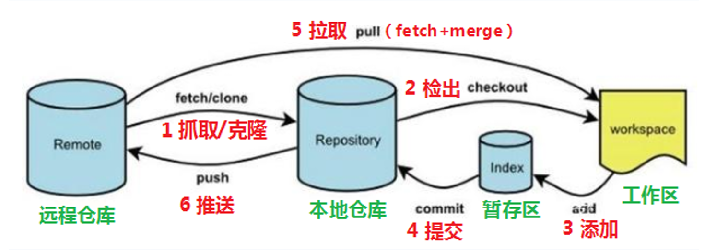
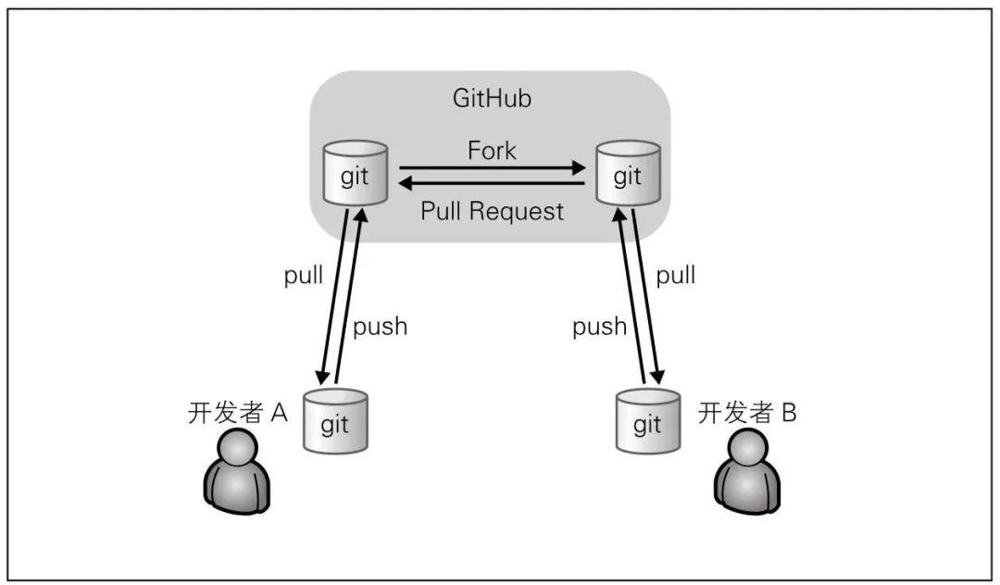

GitHub&GitLab 基础使用
---

### **1. GitHub 基础使用**
1. **核心操作**  
   
   - `git clone`：克隆远程仓库
   
     例：  `git clone git@github.com:your_username/project_name.git`
     
   - `git branch feature`: 创建本地分支
   
   - `git add/commit/push`：提交代码到个人分支  
   
   - `git pull`：同步远程变更  
   
     
   
2. **Pull Request (PR) 流程**  
   ```mermaid
   graph TB
     A[Fork主仓库] --> B[创建特性分支]
     B --> C[提交代码到个人仓库]
     C --> D[发起PR到主仓库]
     D --> E[审核]
     E --> F[合并到主分支]
   ```
   - **关键点**：PR用于向他人仓库提交变更，需通过Review后合并。

---

### **2. GitLab 基础使用**  
1. **核心操作**  
   - 与GitHub类似，但内置CI/CD（`.gitlab-ci.yml`配置流水线）  

2. **Merge Request (MR) 流程**  
   ```mermaid
   graph TB
     A[创建特性分支] --> B[本地开发并推送]
     B --> C[发起MR到主分支]
     C --> D[自动触发CI验证]
     D --> E[审核+手动合并]
   ```
   - **差异**：MR是GitLab对PR的命名，通常直接在同仓库分支间操作。

---

### **3. 操作示例**  
- **GitHub PR**：  
  ```bash
  git checkout -b feature
  git push origin feature  # 推送后网页端发起PR
  ```
- **GitLab MR**：  
  
  ```bash
  git push origin feature  # 推送后网页端自动提示创建MR
  ```

