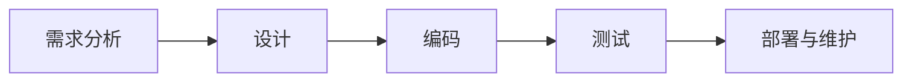
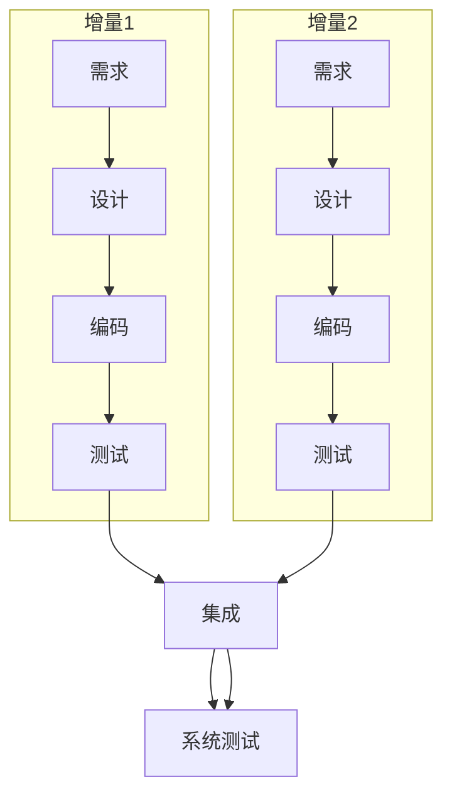
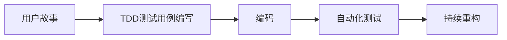
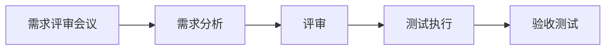

# 研发流程&测试流程

## 1. 通用软件开发阶段


## 2. 开发模型与测试应用

### 2.1 瀑布模型（Waterfall Model）
**特点**：线性顺序开发 
**流程**：
```
需求分析 → 系统设计 → 实现 → 集成测试 → 系统测试 → 维护
```
**测试应用**：

- 测试集中在开发后期
-  **V模型（测试变体）**：
  - 需求分析 ⇄ 验收测试设计
  - 系统设计 ⇄ 系统测试设计
  - 详细设计 ⇄ 集成测试设计
  - 编码 ⇄ 单元测试设计

### 2.2 快速原型模型（Rapid Prototyping）
**特点**：快速构建可演示原型 
**流程**：
```
原型设计 → 用户反馈 → 正式开发 → 测试
```
**测试应用**：
- 原型阶段：用户参与可用性测试
- 正式开发：采用瀑布/迭代模型的测试策略
- 关键价值：通过早期验证降低需求错误率

### 2.3 增量模型（Incremental Model）
**特点**：分批次交付功能模块 
**流程示例**：

**测试应用**：
-  每个增量执行完整测试周期
-  持续回归测试：新增量必须通过旧功能测试
-  集成测试是关键环节

### 2.4 螺旋模型（Spiral Model）
**特点**：风险驱动的迭代开发 
**四象限流程**：
1. 目标设定

2. 风险评估

3. 开发与测试

4. 计划下一迭代 

**测试应用**：

-  测试深度由风险分析决定
-  每轮迭代包含测试活动
-  高风险模块需强化测试（如安全测试/压力测试）

### 2.5 喷泉模型（Fountain Model）
**特点**：面向对象的迭代模型 
**测试应用**：
-  测试活动与开发阶段重叠
-  强调组件测试（类/对象级别）
-  持续进行集成测试

### 2.6 Rational 统一过程（RUP）
**阶段划分**：
| 阶段         | 测试重点                 |
|--------------|--------------------------|
| 初始阶段     | 概念验证测试             |
| 细化阶段     | 架构原型测试             |
| 构建阶段     | 迭代测试（持续增加覆盖率）|
| 交付阶段     | 用户验收测试/UAT         |

**核心实践**：
-  早期制定测试计划
-  每个迭代包含测试活动
-  使用测试指标驱动迭代

### 2.7 敏捷过程与极限编程（XP）
**核心实践**：

**测试应用**：
-  **测试驱动开发（TDD）**：
  
  ```
  写测试 → 运行失败 → 写代码 → 通过测试 → 重构
  ```
-  自动化测试占比＞70%
-  持续集成：每次提交触发测试
-  结对编程：实时代码审查
-  验收测试：客户定义测试标准
-  不断讨论：开发过程中注重各级人员的不断交流

### 2.8 微软过程（Microsoft Process）
**三阶段模型**：
| 阶段     | 测试活动              |
| -------- | --------------------- |
| 计划阶段 | 制定测试策略/用例设计 |
| 开发阶段 | 每日构建+冒烟测试     |
| 稳定阶段 | 重点测试+Bug 分类修复 |

**特色实践**：
-  每日构建（Daily Build）强制冒烟测试
-  Bug 分级机制
-  零 Bug 反弹（Zero Bug Bounce）原则
### 2.9 模型对比与测试策略
| 模型         | 测试介入点   | 测试频率 | 自动化需求 |
|--------------|-------------|---------|-----------|
| 瀑布模型     | 后期        | 低      | 中等      |
| 增量模型     | 每个增量    | 中高    | 高        |
| 螺旋模型     | 每轮迭代    | 高      | 依赖风险  |
| 敏捷/XP      | 持续        | 极高    | 必须      |
| 微软过程     | 每日构建    | 极高    | 必须      |


## 3. 测试的流程


### **3.1 需求阶段**

- **需求评审会议**
  参与产品需求讨论，输出《需求文档》。
  关键动作：确认需求可测试性、消除歧义表述。

- **[测试计划](/Intern/测试学习/TestTheories/测试计划.md)制定**
  输出文件：
  - 《测试计划》（含资源安排/风险预案）
  - 《测试计划评审报告》

### **3.2 需求分析阶段**

**3.2.1 功能点梳理**

- 根据需求文档制作《功能地图矩阵》
- 产出物：XMind 功能点脑图

**3.2.2 测试点设计**

- 每个功能点拆解测试维度（正向/异常/边界）
- 产出物：Excel/XMind 测试点列表

**3.2.3 用例编写**

- 要素包含：操作步骤、前置条件、预期结果
- 覆盖率要求：尽量 100% 覆盖测试需求
- 产出物：《测试用例文档》（Excel 格式）

### **3.3 评审阶段**

- **组内评审**
  测试团队内部验证用例完整性，输出《用例评审报告（初版）》。

- **正式评审**
  需产品、研发共同参与，修订后输出《最终用例评审报告》。

### **3.4 测试执行阶段**

- **版本测试**
  按测试计划时间节点执行用例，每日同步《测试日报》。

- **回归测试**
  缺陷修复后验证，更新《测试报告》（含通过率/缺陷分布）。

### **3.5 验收阶段**

产出《验收测试报告》。

**关键文档清单**

| 阶段 | 核心产出物 |
| --- | --- |
| 需求阶段 | 定稿需求文档 |
| 计划阶段 | 测试计划、评审报告 |
| 分析阶段 | XMind 功能图、测试用例文档 |
| 执行阶段 | 测试报告（含日报/终版） |
| 验收阶段 | 验收测试报告 |


