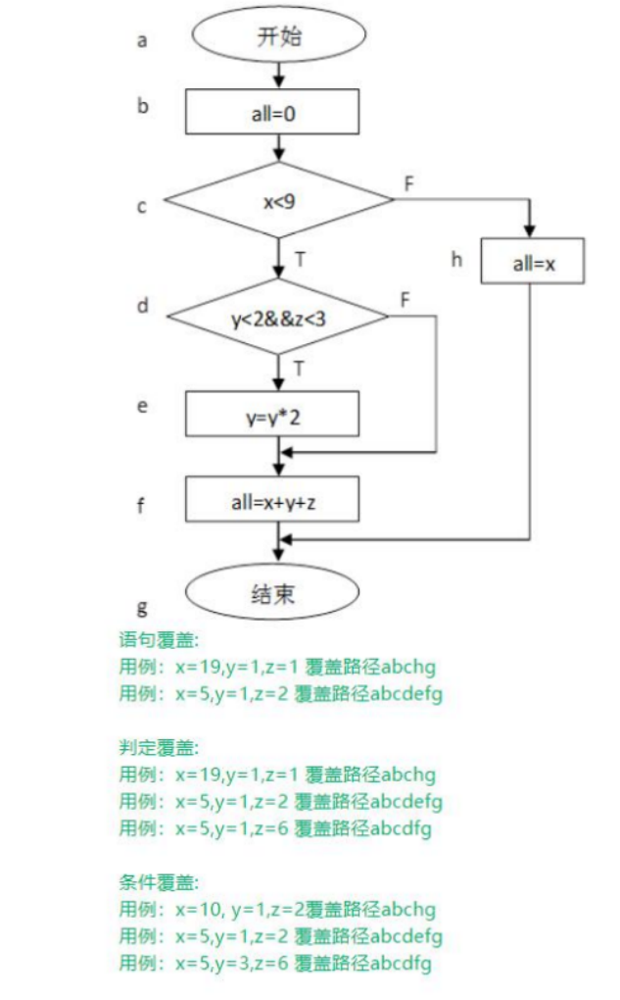

# 测试方法与类型

##  1. 代码可见度划分

### 1.1 黑盒测试

**定义**：关注功能，忽视内部结构。测试基于需求规格。
**核心**：测试输入与预期输出是否匹配。
**技术**：

 * **等价类划分：**
   **思想**： 将输入域划分为**若干“等价类”**，每个类中的数据对于揭露潜在错误被认为是等效的。选择每个等价类的代表值进行测试。
   **目的**： 用少量代表性测试用例**覆盖大量可能输入**。

*  **边界值分析：**
      **思想**： 错误更可能发生在输入域的边界处或其附近。测试每个**等价类边界**和**边界两边**的值（比边界值略小、等于边界值、比边界值略大）。
      **目的**： 发现常见的“差一错误”（如`<=`写成`<`）。

* **决策表测试：**
   **思想**： 适用于处理多个输入条件组合并产生不同动作（输出） 的业务逻辑。将所有可能的**条件组合（因）和对应的动作（果）**列成一个表格
   **目的**： 确保复杂的业务规则在**每一种输入组合**下都能得到正确执行。

* **状态转换测试：**
   **思想**： 适用于系统行为依赖于其内部状态（如工作流、协议栈）。通过**状态图模型状态**、**转移条件**（输入/事件）、**动作**（输出/动作）。
   **目的**： 发现状态转换相关的错误（如不正确的进入/退出条件、遗漏状态、错误的输出动作）。
* **因果图：**
     **思想**： 用于处理复杂的输入条件之间的**逻辑关系（因果）**，并推导出**决策表**。特别适用于条件之间有“与”、“或”、“非”、“异或”等约束的情况（常作为推导决策表的中间步骤）。
     **目的**： 系统化地处理复杂输入条件组合的场景。
     
* **用例场景法：**
     **思想：**将系统功能还原到**用户实际操作场景**中，而非孤立测试单个功能点。优先验证**高频使用路径**和**关键异常路径**（如库存不足、支付失败）。
     **目的：**通过**“以用户动作为线索，串联业务流程”** ，确保系统在真实使用环境中可靠运行。

### 1.2 白盒测试 

**定义**：分析内部代码结构设计测试用例。
**核心**：覆盖代码路径、条件、逻辑。
**技术**：

* **语句覆盖**

   语句覆盖是最基础的白盒测试方法，要求设计测试用例使程序中的**每个可执行语句至少被执行一次**。这种方法简单易实现，但仅能验证代码是否可执行，无法检测逻辑错。

* **判定覆盖（分支覆盖）**

   判定覆盖要求测试用例能使程序中的**每个判断的取真分支和取假分支至少经历一次**。这种方法比语句覆盖更强，能发现一些逻辑错误，但可能忽略复合条件中的单个条件取值。

* **条件覆盖**

    条件覆盖要求测试用例能使**每个判定中的每一个条件都获得可能的取值**（至少有一次真值和假值）。与判定覆盖不同，它关注的是条件本身的取值而非整个判定的结果。

 
* **路径覆盖**

  路径覆盖是**最严格**的覆盖标准，要求测试用例执行程序中的**所有可能的执行路径**。 这种方法能发现复杂的逻辑错误，但路径数量可能呈指数增长，实际应用中难以完全实现。

* **循环覆盖**

    循环覆盖专门针对循环结构，要求测试用例覆盖：
  
  - 循环**零次**执行（跳过循环）。
  - 循环**一次**执行。
  - 循环**多次**执行。
  - 循环**最大次数**执行。


### 1.3 灰盒测试 

* 定义：结合黑盒和白盒，了解部分内部结构辅助测试设计。
* 应用场景：**集成测试、性能测试、安全测试。**

##  2. 功能划分

### 2.1 功能性测试

**目标**：验证软件是否符合功能需求和规范。
子类型：

#### 2.1.1 冒烟测试

**阶段**：每日构建/版本发布前。
**方法**：  

- 执行核心功能用例（约 5-10 个关键场景） 。 
- 自动化脚本优先（如 Selenium/Postman） 。 
- 失败则阻止后续测试流程 。 

####  2.1.2 健全测试

**阶段**：缺陷修复验证时 。
**方法**：  

- 针对修复模块设计定向用例。 
- 结合代码变更分析（Git Diff）选择测试范围  。
- 手动验证为主，耗时<1 小时 。

####  2.1.3 回归测试  

**阶段**：版本迭代/补丁发布前 。 
**方法**：  

- 自动化测试套件全覆盖。  
- 基线用例库维护（覆盖 80%核心功能）。  
- 风险驱动选择测试范围  。

####  2.1.4 用户接受测试 

**阶段**：上线前 1-2 周。  
**方法**：  

- 业务用户按真实场景测试。  
- 提供测试数据工厂（Mock 数据）。  
- 签署《验收确认书》。  

####  2.1.5 互操作性测试 

**阶段**：系统联调阶段。  
**方法**：  

- 搭建真实环境拓扑（Docker/K8s）。  
- 协议兼容性验证（如 API 版本校验）。  
- 性能边界测试（高并发场景）。  

> 冒烟→健全→回归采用自动化优先。

### 2.2 非功能性测试


#### **2.2.1 性能测试**
**目标**：评估系统响应速度、吞吐量、资源利用率等指标。  
**测试方法**：  

- **负载测试**：模拟不同并发用户数（如 100/500/1000 用户），监测响应时间、TPS（每秒事务数）。  
- **压力测试**：逐步增加负载至系统崩溃点（如 200%设计容量），确定瓶颈（CPU/内存/数据库）。  
- **工具**：JMeter、LoadRunner
**执行时机**：  
- 核心功能完成后。  
- 重大架构变更后（如数据库分库分表）。  
- 上线前必经环节。  


#### **2.2.2 稳定性测试 vs 可靠性测试**
| **测试类型**       | **目标**                          | **测试方法**                                  | **执行时机**              |
|--------------------|-----------------------------------|---------------------------------------------|--------------------------|
| **稳定性测试**     | 验证**长时间运行**能力            | - 7×24 小时持续中运行      | 版本发布前，性能测试之后 |
|                    |                                   | - 监控内存泄漏、资源累积（线程/连接池）       |                          |
| **可靠性测试**     | 验证**故障恢复**能力              | - **主动注入故障**：网络中断、节点宕机        | 高可用架构部署后         |
|                    |                                   | - 验证数据一致性（如主从切换）、容错机制      | 灾备演练周期             |

**关键区别**：  

- **稳定性**：关注持续运行不崩溃 → "**耐力测试**"  
- **可靠性**：关注故障后自动恢复 → "**抗打击能力测试**"  


#### **2.2.3 扩展性测试**
**目标**：验证水平/垂直扩展对性能的提升效果。 
**测试方法**：  

- **水平扩展**：增加节点（如从 2 台服务器扩展到 4 台），验证负载均衡效果及吞吐量提升比例。
- **垂直扩展**：升级单节点资源（CPU从 4 核→8 核），观测单机性能增幅。  
**关键指标**：扩展比（如资源增加 100%，性能提升≥80%为理想）。
**执行时机**：  
- 架构设计阶段（原型验证）。  
- 业务量预计大幅增长前。


#### **2.2.4 可用性测试**
**目标**：评估用户使用效率与主观满意度。  
**测试方法**：  

- **专家评审**：启发式评估  
- **用户测试**：  
  - 任务完成率（如让新用户完成注册流程，记录成功率）  
  - SUS（系统可用性量表）问卷（得分≥68/100 为合格）  
  - 眼动追踪/操作热力图分析  
- **执行时机**：  
  - 原型设计阶段（Paper Prototype）  
  - UI 重大改版后  
  - 每季度定期评估  


#### **2.2.5 安全测试**
**目标**：识别漏洞，保护数据与系统完整性。  
**测试方法**：  

| **方法** | **具体操作**                              |
| :------- | ----------------------------------------- |
| 渗透测试 | 模拟黑客攻击（SQL 注入、XSS、CSRF）       |
| 漏洞扫描 | 使用 Nessus、OpenVAS 扫描已知漏洞         |
| 代码审计 | 检查敏感数据加密（AES-256）、权限控制逻辑 |
| 配置审计 | 验证防火墙规则、SSL 证书强度              |

**执行时机：**

- 每次迭代交付前（DevSecOps 流程）。
- 合规性要求（如 GDPR、等保三级）审计前。 
- 遭受攻击后的复盘。 

#### **2.2.6 兼容性测试**
**目标**：确保系统在不同环境下正常运行。  
**测试维度**：  

| **维度**   | **测试场景举例**                             |
| ---------- | -------------------------------------------- |
| 浏览器/OS  | Chrome v120+ / Firefox / Safari；Win11/macOS |
| 移动设备   | iOS 16+ & Android 12+，不同屏幕分辨率        |
| 网络环境   | 弱网（3G）、高延迟（200ms+）                 |
| 第三方依赖 | JDK 17→11 降级、MySQL 8.0→5.7兼容性          |

**执行时机**：  
- 新产品支持多平台时（如 Web 转移动端） 。 
- 依赖库升级/操作系统大版本更新后。  

##  3. 阶段划分

- **单元测试**：验证单个代码单元（函数、方法、类）。
- **集成测试**：测试模块/组件间接口和数据交互。
- **系统测试**：测试完整集成系统是否符合需求。
- **验收测试**：最终用户验证系统是否满足业务需求。（ UAT、合同验收测试等）

##  4. 测试执行方式

### 4.1**手动测试**：

人工执行用例、观察结果。

### **4.2自动化测试类型及介入策略**
#### **4.2.1 单元测试**  
- **介入时机**：开发阶段（编码完成后立即介入）  
- **介入方式**：  
  - 开发人员编写测试代码，与业务代码同步提交。  
  - 集成到CI流水线（每次代码提交触发执行） 。 
- **常用工具**：  
  - **Java**: JUnit, TestNG  
  - **Python**: unittest, pytest  
  - **JavaScript**: Jest, Mocha  

#### 4.2.2 接口测试  
- **介入时机**：后端服务开发完成，前端未就绪时（早期介入）  
- **介入方式**：  
  - 基于接口契约（如 OpenAPI/Swagger）生成测试用例。  
  - 模拟上下游服务进行集成验证。  
- **常用工具**：  
  - Postman, pytest（性能+接口）  
  - REST Assured（Java）, Requests（Python）  

#### 4.2.3 UI自动化测试  
- **介入时机**：前端界面稳定后（避免频繁因 UI 变更导致脚本失效）  
- **介入方式**：  
  - 基于页面元素定位（XPath/CSS Selector）模拟用户操作。  
  - 优先覆盖核心流程（如登录、支付）  。
- **常用工具**：  
  - **Web端**：Selenium, Cypress, Playwright ,pytest
  - **移动端**：Appium, Espresso（Android）, XCTest（iOS）  
  - **桌面应用**：WinAppDriver, Pywinauto  

#### **4.2.4 性能测试**  
- **介入时机**：功能稳定后，上线前进行负载验证  
- **介入方式**：  
  - 模拟多用户并发压力（阶梯式增加负载）。  
  - 监控系统资源（CPU/内存/响应时间）。  
- **常用工具**：  
  - **负载工具**：JMeter, LoadRunner, Gatling  
  - **监控工具**：Grafana+Prometheus, New Relic  

#### 4.2.5 持续测试 
- **介入时机**：贯穿整个 CI/CD 流水线  
- **介入方式**：  
  
  - 单元/接口测试在**构建阶段**快速反馈。  
  - UI/性能测试在**预发布环境**深度验证。  
- **集成工具链**：  
  ```mermaid
  graph LR
    A[代码提交] --> B(CI服务器触发)
    B --> C[运行单元测试]
    C --> D[构建部署测试环境]
    D --> E[执行接口测试]
    E --> F[UI自动化回归]
    F --> G[性能测试]
    G --> H[生成测试报告]

### 4.3 **探索性测试**：

边设计边执行，依赖测试者技能和经验。

##  5. 测试环境维度

1. **Alpha 测试**：开发环境下由内部用户测试早期版本。
2. **Beta 测试**：真实环境中由外部用户测试预发布版本。
3. **生产环境测试**：有限度在线上环境测试新功能。